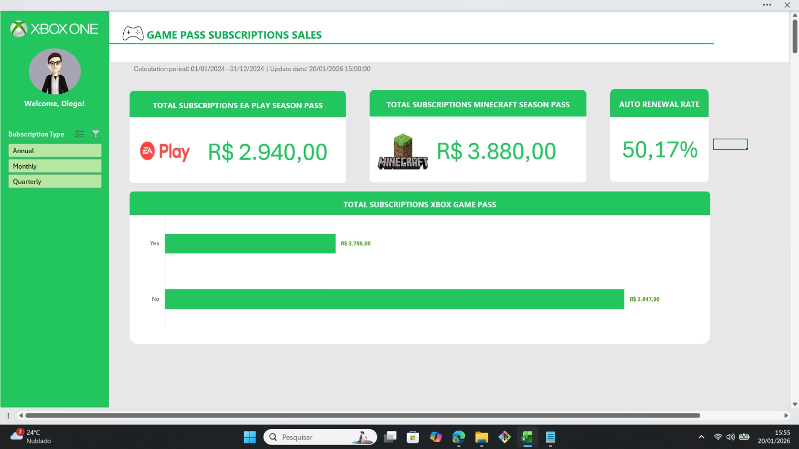

# 📊 Dashboard de Vendas – Xbox Game Pass

Projeto do Bootcamp Santander | Dashboard de Vendas do Xbox Game Pass no Excel (DIO)

---

## 🧠 Entendendo o Desafio

O objetivo deste desafio é criar um dashboard de vendas, com foco na organização e visualização de dados.  
A proposta é transformar dados brutos em informações visuais claras e úteis, permitindo uma análise eficaz do desempenho de vendas e apoiando a tomada de decisões baseadas em dados.

---

## 🎯 Objetivo do Projeto

Desenvolver um dashboard interativo no Microsoft Excel para analisar as vendas de assinaturas do Xbox Game Pass, considerando diferentes tipos de planos, produtos inclusos e a presença de renovação automática.

---

## 📁 Base de Dados

Base de dados fornecida pela DIO, contendo informações sobre:
- Tipo de assinatura (Annual, Monthly, Quarterly)
- Produtos inclusos (EA Play, Minecraft)
- Valor das vendas
- Renovação automática (Yes / No)
- Período de vendas

---

## 📈 Indicadores e Análises Apresentadas

O dashboard responde às seguintes perguntas de negócio:

- Qual o faturamento total de vendas do Game Pass com EA Play?
- Qual o faturamento total de vendas do Game Pass com Minecraft?
- Qual é a taxa de vendas com renovação automática?
- Como o faturamento dos planos anuais se distribui entre vendas com e sem renovação automática?

### Principais KPIs:
- 💰 Total de vendas do Game Pass com EA Play
- 💰 Total de vendas do Game Pass com Minecraft
- 🔄 Taxa de Auto Renovação (%)
- 📊 Faturamento dos planos anuais por status de renovação

---

## 🖥️ Visual do Dashboard

O dashboard foi desenvolvido em uma aba exclusiva, com foco em clareza visual, leitura rápida e padronização de layout, utilizando a identidade visual do Xbox.

---

## 🛠️ Ferramentas e Recursos Utilizados

- Microsoft Excel
- Tabelas Dinâmicas
- Segmentações de Dados
- Gráficos
- Cartões de KPI
- Células auxiliares para cálculos
- Boas práticas de organização de dashboards

---

## 📌 Estrutura do Arquivo Excel

- **Bases**: dados brutos
- **Cálculos**: métricas e indicadores
- **Dashboard**: visualização final e interativa

---

## 📚 Observações Finais

Este projeto foi desenvolvido com fins educacionais, como parte de um desafio prático da DIO, com o objetivo de consolidar conhecimentos em análise de dados, visualização de informações e criação de dashboards no Excel.

---

🚀 Projeto desenvolvido por **Bernardo Aguilera**
